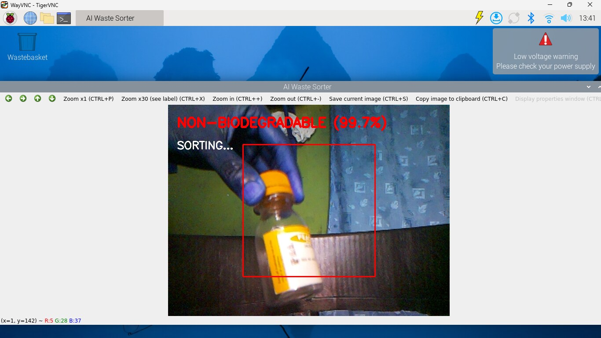
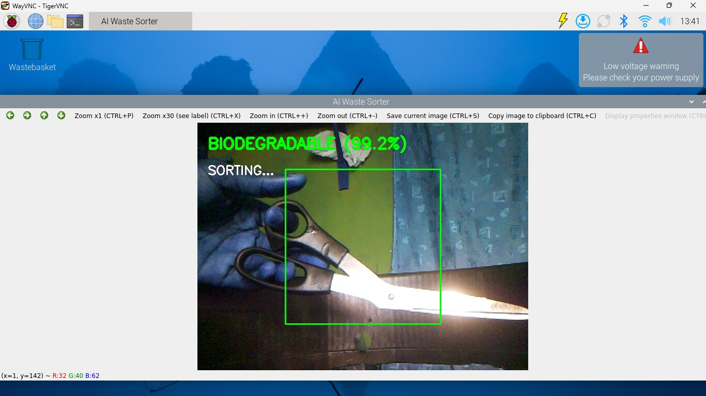
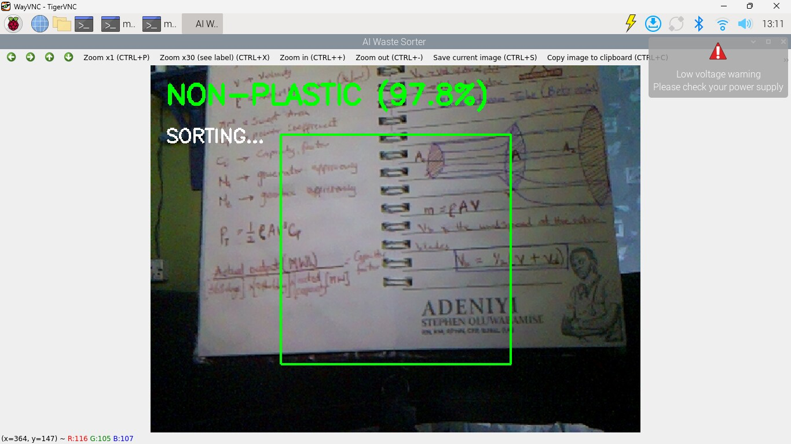

bash

cat > /mnt/user-data/outputs/README.md << 'EOF'
# AI-Based Waste Recognition and Automated Sorting System

> **Student ID:** EEE_22_00XX
> **Project Type:** Final Year Undergraduate Engineering Project  
> **Classification:** Biodegradable vs Non-Biodegradable Waste  
> **Hardware:** Raspberry Pi 3 Model B + Pi Camera Module Rev 1.3 + MG90 Servo Motor  
> **Version:** 1.0 — September 2026




---

## Overview

This project implements a real-time, AI-powered waste sorting system that automatically classifies waste items as **Biodegradable** or **Non-Biodegradable** using a camera and a machine learning model, then physically sorts each item into the correct bin using a servo motor.

The system runs entirely on a Raspberry Pi 3 — no cloud connection, no external server, no manual intervention required. Once powered on, it starts sorting automatically.

---

## How It Works

```
Power On
    ↓
Camera watches for motion (Stage 1 — Object Detection)
    ↓
Object detected → classify the item (Stage 2 — AI Classification)
    ↓
BIODEGRADABLE     → servo rotates to -90° → item falls into Biodegradable bin
NON-BIODEGRADABLE → servo rotates to +90° → item falls into Non-Biodegradable bin
UNCERTAIN         → no servo action → item stays for manual review
    ↓
Servo returns to home (0°) → wait for next item
```

---

## Project Structure

```
waste_sorter/
├── classify.py                          # Main application — runs on Raspberry Pi
├── sorter.log                           # Auto-generated classification log
│
└── models/
    ├── plastic_classifier.tflite                  # Original TFLite model
    └── plastic_classifier_compatible.tflite       # Deployed model (compatibility-fixed)

Development Machine (Windows Laptop):
waste_sorter/
├── train_model.py                       # Model training script
├── convert_to_tflite.py                 # TFLite conversion script
├── check_data.py                        # Dataset cleaning script
├── test_webcam.py                       # PC webcam live testing script
├── plastic_classifier.h5                # Full trained Keras model
├── plastic_classifier_compatible.tflite # Converted model for Pi
│
└── dataset/
    ├── plastic/                         # 6,143 training images
    └── non_plastic/                     # 5,718 training images
```

---

## Hardware Setup

### Components Required

| Component | Model | Purpose |
|---|---|---|
| Single-Board Computer | Raspberry Pi 3 Model B | Central processing and control |
| Camera | Pi Camera Module Rev 1.3 (OV5647) | Image capture |
| Servo Motor | MG90 (metal gear) | Sorting mechanism actuation |
| Power Supply | 5V 2.5A micro-USB | System power |
| Storage | 16 GB microSD (Class 10) | OS and application |
| Collection Bins | x2 labelled containers | Biodegradable / Non-Biodegradable |

### GPIO Wiring

| Servo Wire | Colour | Raspberry Pi Pin | GPIO |
|---|---|---|---|
| Signal | Orange | Physical Pin 12 | GPIO 18 (Hardware PWM) |
| Power | Red | Physical Pin 2 | 5V Rail |
| Ground | Brown | Physical Pin 6 | GND |

> **Important:** GPIO 18 uses hardware PWM enabled via device tree overlay. This is configured in `/boot/firmware/config.txt` — see Software Setup below.

### Servo Positions

| Position | Angle | Meaning |
|---|---|---|
| Home / Idle | 0° | Lid closed — waiting for item |
| Non-Biodegradable bin | +90° | Plastic/non-biodegradable item detected |
| Biodegradable bin | -90° | Biodegradable item detected |

---

## Software Setup

### Operating System

**Raspberry Pi OS Legacy 64-bit (Bookworm)**

> Do NOT use Debian Trixie (the default latest) — it is incompatible with the camera stack and tflite-runtime required for this project.

Flash using Raspberry Pi Imager v2.0.7:
- Device: Raspberry Pi 3
- OS: Raspberry Pi OS (Legacy, 64-bit)
- Enable SSH and configure WiFi during flashing

---

### Step 1 — Enable Hardware PWM for Servo

```bash
sudo nano /boot/firmware/config.txt
```

Add this line at the bottom:

```
dtoverlay=pwm,pin=18,func=2
```

Save and reboot:

```bash
sudo reboot
```

---

### Step 2 — Install System Dependencies

```bash
sudo apt update
sudo apt install -y libcamera-apps libcap-dev python3-libcamera python3-kms++ python3-opencv
```

---

### Step 3 — Create Python Virtual Environment

```bash
python3 -m venv ~/waste_sorter_env
source ~/waste_sorter_env/bin/activate
```

---

### Step 4 — Install Python Packages

```bash
pip install numpy==1.26.4
pip install tflite-runtime==2.14.0
pip install picamera2
pip install gpiozero
pip install RPi.GPIO
```

> **Note:** NumPy must be pinned to 1.26.4 — tflite-runtime 2.14.0 is incompatible with NumPy 2.x.

---

### Step 5 — Link System Packages into Virtual Environment

```bash
ln -s /usr/lib/python3/dist-packages/libcamera ~/waste_sorter_env/lib/python3.11/site-packages/
ln -s /usr/lib/python3/dist-packages/pykms ~/waste_sorter_env/lib/python3.11/site-packages/
ln -s /usr/lib/python3/dist-packages/cv2.cpython-311-aarch64-linux-gnu.so ~/waste_sorter_env/lib/python3.11/site-packages/
```

---

### Step 6 — Copy Model to Pi

From your development laptop (run this on the laptop, not the Pi):

```bash
scp plastic_classifier_compatible.tflite momentum@<pi_ip_address>:~/waste_sorter/models/
```

---

### Step 7 — Set Up Auto-Start Service

Create the service file:

```bash
sudo nano /etc/systemd/system/waste-sorter.service
```

Paste this:

```ini
[Unit]
Description=AI Waste Sorting System
After=graphical.target

[Service]
Type=simple
User=momentum
WorkingDirectory=/home/momentum/waste_sorter
Environment="PATH=/home/momentum/waste_sorter_env/bin:/usr/local/sbin:/usr/local/bin:/usr/sbin:/usr/bin:/sbin:/bin"
Environment="DISPLAY=:0"
Environment="XAUTHORITY=/home/momentum/.Xauthority"
ExecStart=/home/momentum/waste_sorter_env/bin/python /home/momentum/waste_sorter/classify.py
Restart=on-failure
RestartSec=5
StandardOutput=append:/home/momentum/waste_sorter/sorter.log
StandardError=append:/home/momentum/waste_sorter/sorter.log

[Install]
WantedBy=graphical.target
```

Enable and start:

```bash
sudo systemctl daemon-reload
sudo systemctl enable waste-sorter.service
sudo systemctl start waste-sorter.service
```

---

## Running the System

### Automatic (Recommended)

Once the service is enabled, the system starts automatically every time the Pi powers on. No commands needed.

### Manual (for testing)

```bash
source ~/waste_sorter_env/bin/activate
python ~/waste_sorter/classify.py
```

### Check System Status

```bash
sudo systemctl status waste-sorter.service
```

### View Classification Log

```bash
tail -50 ~/waste_sorter/sorter.log
```

### Stop the System

```bash
sudo systemctl stop waste-sorter.service
```

### Restart After Code Changes

```bash
sudo systemctl restart waste-sorter.service
```

---

## Remote Access via TigerVNC

The system works in two modes simultaneously:

| Mode | What happens |
|---|---|
| **Standalone (no connection)** | Sorts silently — camera detects objects, servo actuates, log records results |
| **Connected via TigerVNC** | Live window appears showing camera feed, classification label, and confidence % |

To connect: open TigerVNC Viewer on your laptop and enter `wastesorter.local:5900` or `<pi_ip>:5900`.

---

## The Machine Learning Model

### Model Details

| Property | Value |
|---|---|
| Base Architecture | MobileNetV2 (pretrained on ImageNet) |
| Training Method | Transfer Learning — 2 stages |
| Input Size | 224 × 224 pixels (RGB) |
| Output | Sigmoid — probability of Non-Biodegradable (plastic) |
| Classes | Biodegradable (index 0), Non-Biodegradable (index 1) |
| Test Accuracy | 92.4% |
| Model Size (TFLite) | 2.41 MB |
| Quantization | Dynamic range quantization |
| Training Framework | TensorFlow 2.21.0 |
| Inference Runtime | tflite-runtime 2.14.0 |

### Dataset

| Class | Images |
|---|---|
| Non-Biodegradable (plastic) | 6,143 |
| Biodegradable (non-plastic) | 5,718 |
| **Total** | **11,861** |

**Sources:**
- Initial binary plastic/non-plastic dataset (Kaggle)
- Plastic Waste Around the World — Isaac Langit (Kaggle)
- Plastic Object Detection Dataset — DataCluster Labs (Kaggle)

### Training (on Development Laptop)

```bash
# Activate virtual environment
.venv\Scripts\activate

# Clean dataset
python check_data.py

# Train model (1-3 hours on CPU)
python train_model.py

# Convert to TFLite
python convert_to_tflite.py

# Test on PC webcam
python test_webcam.py
```

---

## Confidence Threshold

The system uses a confidence threshold of **0.55 (55%)** to decide whether to sort or flag as uncertain:

| Prediction Probability | Label | Servo Action |
|---|---|---|
| >= 0.55 | NON-BIODEGRADABLE | Rotates to +90° |
| <= 0.45 | BIODEGRADABLE | Rotates to -90° |
| 0.45 – 0.55 | UNCERTAIN | No action — stays at home |

To adjust the threshold, change this line in `classify.py`:

```python
CONFIDENCE_THRESHOLD = 0.55
```

Lower values (e.g. 0.45) catch more items but may increase false positives.
Higher values (e.g. 0.65) are more conservative but may miss some items.

---

## Motion Detection Settings

The system uses frame differencing to detect when an object is placed in front of the camera. Two values control sensitivity:

```python
MOTION_THRESHOLD = 25     # pixel brightness change to count as motion
MOTION_MIN_AREA  = 3000   # minimum changed area in pixels
```

**If the system triggers on nothing (too sensitive):**
- Increase `MOTION_MIN_AREA` to 5000 or higher

**If the system misses objects (not sensitive enough):**
- Decrease `MOTION_THRESHOLD` to 15
- Decrease `MOTION_MIN_AREA` to 1500

---

## Troubleshooting

| Problem | Likely Cause | Fix |
|---|---|---|
| Service not starting | Virtual environment path wrong | Check path in waste-sorter.service matches your username |
| Camera not detected | Ribbon cable loose or wrong OS | Check CSI cable; must use Bookworm Legacy not Trixie |
| Servo not moving | PWM not enabled | Confirm `dtoverlay=pwm,pin=18,func=2` is in config.txt and Pi has rebooted |
| Servo humming when idle | PWM signal still active | `servo.detach()` is called after each sort — check classify.py |
| `ModuleNotFoundError: libcamera` | Symlink missing | Re-run the symlink commands in Step 5 |
| `numpy.core.multiarray failed` | NumPy 2.x installed | Run `pip install numpy==1.26.4` |
| `FULLY_CONNECTED version 12` error | Wrong .tflite file | Use `plastic_classifier_compatible.tflite` not the original |
| TigerVNC shows black screen | Display not ready at boot | Wait 60 seconds after boot before connecting |
| Everything classified as BIODEGRADABLE | Poor lighting or object too far | Improve lighting; move object closer to camera |

---

## Known Limitations

- Binary classification only (Biodegradable vs Non-Biodegradable) — does not distinguish between paper, metal, glass separately
- One item at a time — does not support continuous conveyor belt feeding
- Sensitive to lighting conditions significantly different from training data
- Inference latency of 300–500 ms limits throughput to approximately 1 item per 6–7 seconds
- No persistent bin-full detection

---

## Future Improvements

- Multi-class sorting (paper, metal, glass, organic, plastic as separate categories)
- Conveyor belt integration for higher throughput
- Upgrade to Raspberry Pi 4/5 for faster inference
- IR sensor for more reliable object detection vs motion detection
- IoT dashboard for remote monitoring via MQTT/Grafana
- Mobile app for system status and statistics
- Solar power for outdoor/off-grid deployment

---

## Development Environment

### Raspberry Pi (Deployment)

| Component | Version |
|---|---|
| OS | Raspberry Pi OS Legacy 64-bit (Bookworm) |
| Python | 3.11 |
| tflite-runtime | 2.14.0 |
| NumPy | 1.26.4 |
| OpenCV | 4.6.0 |
| picamera2 | 0.3.36 |
| gpiozero | Latest |

### Development Laptop (Training)

| Component | Version |
|---|---|
| OS | Windows 11 |
| Python | 3.11 |
| TensorFlow | 2.21.0 |
| NumPy | Latest |
| OpenCV | Latest |

---

## License

This project was developed as a Final Year Undergraduate Engineering Project. All code is original work by the author (Student ID: EEE_22_0060). Dataset sources are credited to their respective Kaggle authors.

---

*Last updated: September 2026*
EOF
echo "README written successfully"
Output
